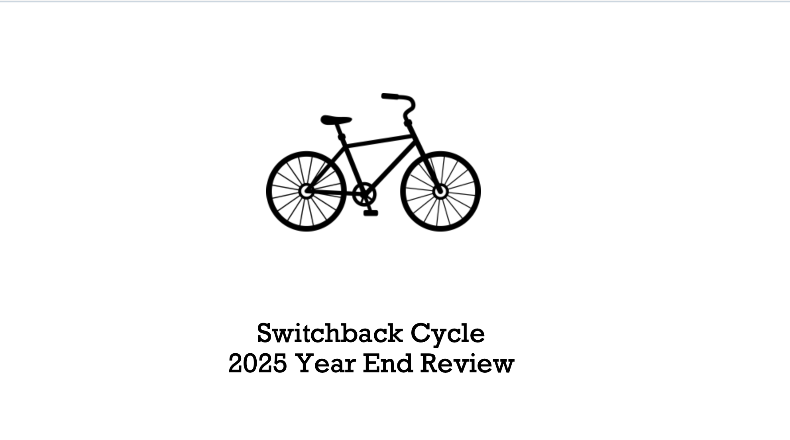
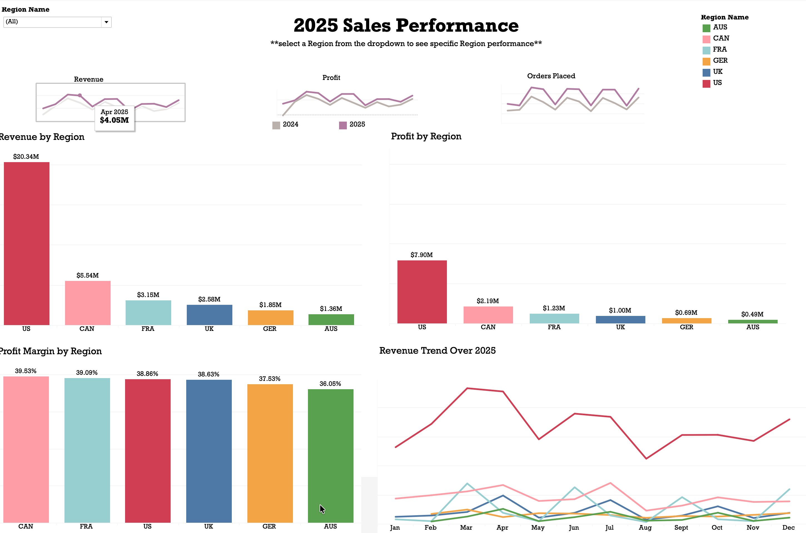
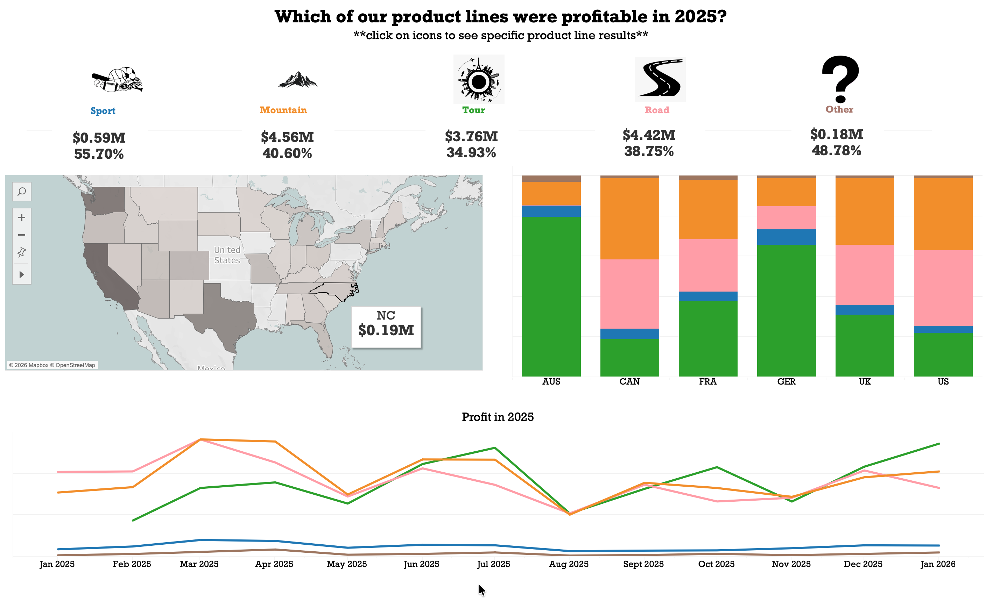
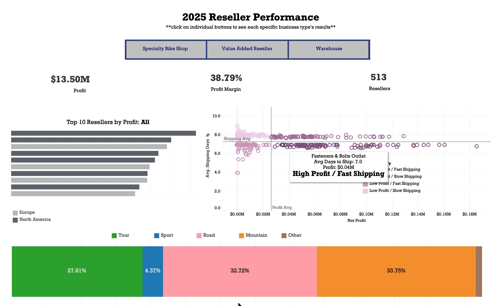
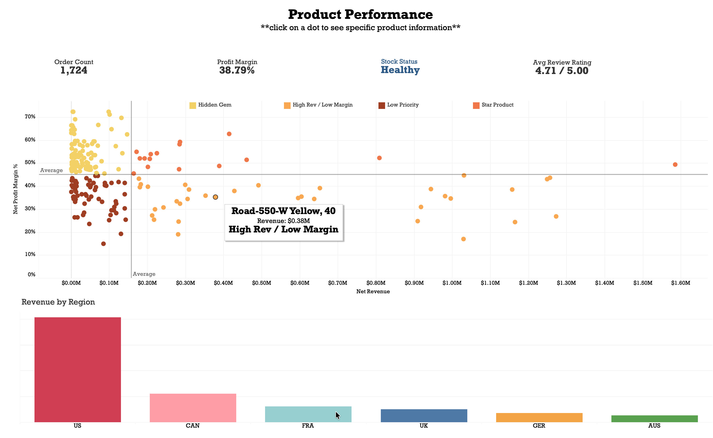
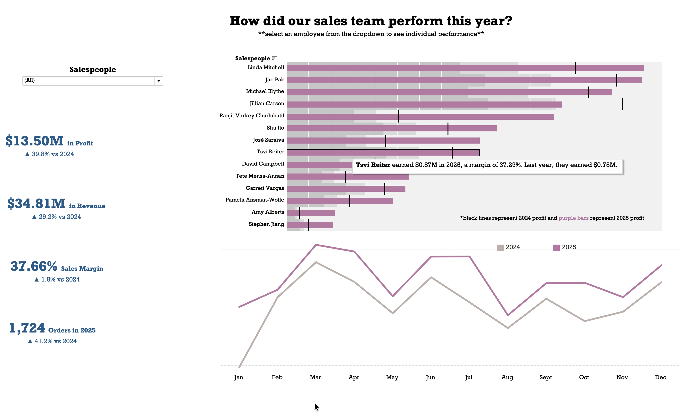

# Switchback Cycle - Executive Analytics Dashboard

**Business Intelligence | Retail Analytics | Tableau**

## Project Overview

I developed an end-to-end Tableau analytics solution for Switchback Cycle, a bicycle manufacturer operating through a reseller network.

The project was designed around five executive priorities: profitability, reseller performance, supply chain resilience, product strategy, and business risk.

## Business Question

**Is revenue growth translating into sustainable profitability, or are discounts, freight costs, and product mix eroding margins?**

## What I Built

I developed a multi-dashboard Tableau solution integrating multiple operational data sources to analyze:

- Revenue, profit, and margin performance
- Regional performance and trends
- Product profitability and product mix
- Reseller performance and risk
- Inventory and supply chain indicators
- Sales-team performance
- Year-over-year performance

## Analytical Approach

- Standardized revenue and profitability calculations across dashboard views
- Built revenue-versus-margin product segmentation
- Developed a reseller risk framework combining profitability, payment terms, and shipping performance
- Analyzed discount, COGS, freight, inventory, and regional performance
- Compared year-over-year sales-team performance using profit, margin, revenue, and order metrics
- Designed interactive Tableau dashboards for executive-level decision making

## Tools & Skills

**Tableau** · **SQL** · **Excel**

Business Intelligence · Data Visualization · Retail Analytics · Profitability Analysis · KPI Development · Product Segmentation · Reseller Analysis · Supply Chain Analytics

## Confidentiality

This project was completed as part of an academic engagement and is subject to confidentiality restrictions.

The underlying datasets, Tableau workbook, calculations, and other restricted project materials are therefore not included in this repository.

This repository documents the business problem, analytical approach, and skills demonstrated while respecting the confidentiality requirements of the project.

## Dashboard Preview

### 1. Switchback Cycle Executive Overview

### 2. 2025 Sales Performance

### 3. Product Line Performance

### 4. 2025 Reseller Performance

### 5. Product Performance

### 6. Sales Team Performance

